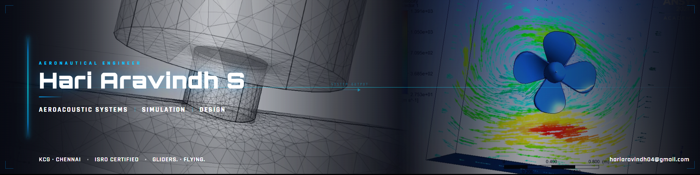

<  >

<h1 align="center">Hari Aravindh S</h1>
<h3 align="center">
Aeronautical Engineering Graduate • Computational Engineering • Aeroacoustics
</h3>

Focused on simulation-driven engineering, numerical methods, and propulsion-adjacent aerospace systems.

---

## About Me

- Developing computational engineering workflows using Python and scientific computing
- Interested in aeroacoustics, transient thermal systems, and simulation-driven aerospace analysis
- Exploring numerical methods, CFD workflows, and engineering validation methodologies
- Incoming Technical Publication Engineer at Capgemini

---

## Technologies & Tools

  <!-- Programming -->
  
  
  
  <!-- Scientific Computing -->
  
  

  <!-- Simulation -->
  
  
  

  <!-- CAD -->
  
  

---

## Featured Projects

### CFD Numerical Solver
Numerical solver for the unsteady 1D heat equation using finite difference methods with NumPy and Matplotlib.

**Focus Areas**
- Transient thermal analysis
- Numerical discretization
- Stability behavior
- Scientific visualization

---

### Bus Booking System
Python backend with MySQL integration for ride scheduling and booking workflows.

**Focus Areas**
- Backend development
- Database integration
- Scheduling logic
- Structured data workflows

---

## Current Direction

Currently building deeper capabilities in:
- computational aerospace engineering
- simulation-driven analysis
- aeroacoustic systems
- propulsion-adjacent engineering workflows

while preparing for advanced aerospace research opportunities.

---

## Connect

  

  

  

---

  

---

##  Lets Connect !
- ✉️ [Email](mailto:your.hariaravindh04@gmail.com)  
- 🔗 [LinkedIn](https://www.linkedin.com/in/hari-aravindh-aviation/)

---

<!--
- 
- 
-->

 
 
 
